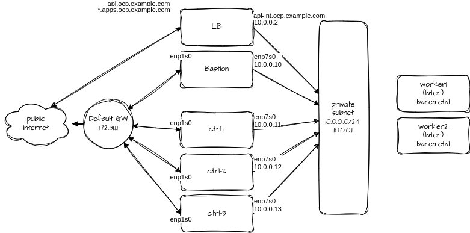

# OCP Cluster at Hetzner Cloud

This repo holds automation for setting up base infra for hosting
[OpenShift](https://www.redhat.com/openshift) at Hetzner. It consists
of ansible playbooks to set up the infra. It also requires some manual steps.

I'll write a blog around this once done.

# Setup the infra

Playbooks:

* **[01-infra](./01-infra.yml)** - Sets up the bastion VM and basic networks
* **[02-controllers](./02-controllers.yml)** - Sets up OCP controllers, and LB
* **[03-probe-settings](./03-probe-settings.yml)** - Fetches settings needed for agent-install
* **[04-collect-settings](./04-collect-settings.yml)** - Writes config files for agent-install
* [bastion-setup](./bastion-setup.yml) - Optional handy utility to setup bastion for OCP install

# Create Agent installer

After running the previous, you need to create ISO image for the installation.
Download the openshift-install tool from
[Red Hat Downloads](https://console.redhat.com/openshift/downloads).

```
mkdir agent; cd agent
cp ../agent-config.yaml install-config.yaml .
./openshift-install --dir . agent create image
```

# Three ways I tried

Which all of them failed. I see the most promising would be the third option,
if I had more time I'd look deeper into it. But now I need to do other stuff.
The intranet would allow adding physical workers from the hetzner baremetal
side later. See each branch ansibles, they differ according to setup.



## Branch main: With public and private networking

This was my first goal. Main branch has the setup that creates intranet for
cluster internal comms. But since there is no router in intranet, I added
public interfaces to each three masters to be able to download containers,
operators and stuff from internet. The Hetzner LB is for the public access.

This installed the ctrl-2 and ctrl-3 nodes, but they could not form the VXLAN
for whatever reason. Cluster services failed due they can't talk to each other
via the 172 -serviceNetwork. I suspect they try talking across the networks,
from intra to public, which is not possible. Like not all the services would be
bound to intranet. See failure.txt in branch.

## Branch publicnet: Only using public facing interfaces

I removed all the intranet connectivity, and set LB to point to public
interfaces. This installation doesn't even get to point where it would start
dumping stuff to disk. I added all firewall openings between the hosts. But for
whatever reason it fails to start install. See failure.txt in branch.

## Branch bastion-gw: Only private network, but bastion as gateway to internet

I briefly tried this, and would perhaps continue this way. The downnside there
is single point of failure of bastion, which I don't like so much. I didn't
have enough time to set the forwarding working from nodes to internet via
bastion. However this would be the next path to try, as OCP cluster is nicely
isolated from internet.

# General notes

* Hetzner does not have GW for intranet. Setting it up with VM would be SPOF.
* Hetzner VM size is not 16GB, but installation validation fails with: `Require
  at least 16.00 GiB RAM for role master, found only 15.62 GiB`. So either go
  with 32GB uselessly expensive VM, or disable the memory check of 16 GB.
* The networking uses something called private networking, which may cause some
  problems. It's L3 only. See
  * [Networks](https://docs.hetzner.com/cloud/networks/overview)
  * [Network Architecture](https://docs.hetzner.com/cloud/networks/technical-concepts/architecture)
